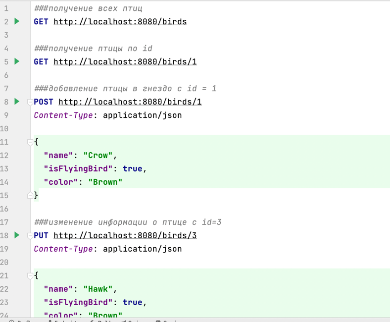

#Задание для компании MoySklad 

##Инстркуция по запуску программы

###Запуск программы
``````
mvn spring-boot:run
``````

###Все примеры запросов описаны в файле src/main/resources/requests.http



####Для получения формального отчета по всем гнездам и птицам в них создан специальный запрос:
``````
http://localhost:8080/nests
``````

###Также было реализовано юнит тестирование с помощью библиотеки JUnit
Протестирована работа двух сервисов